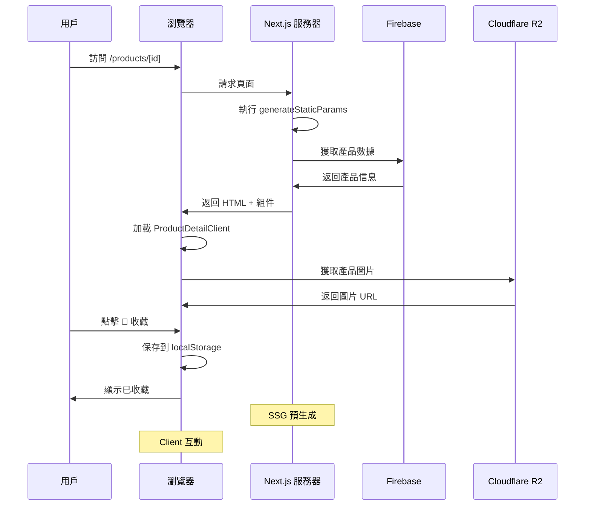
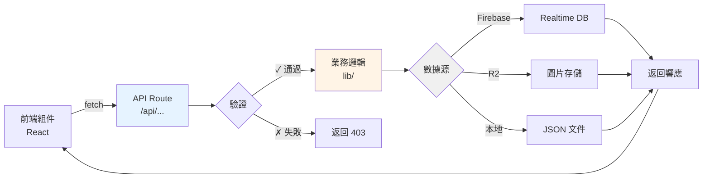
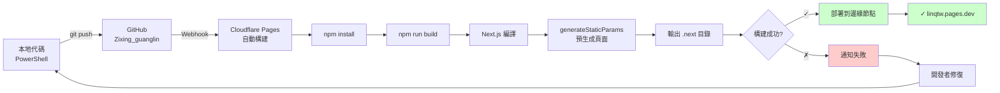
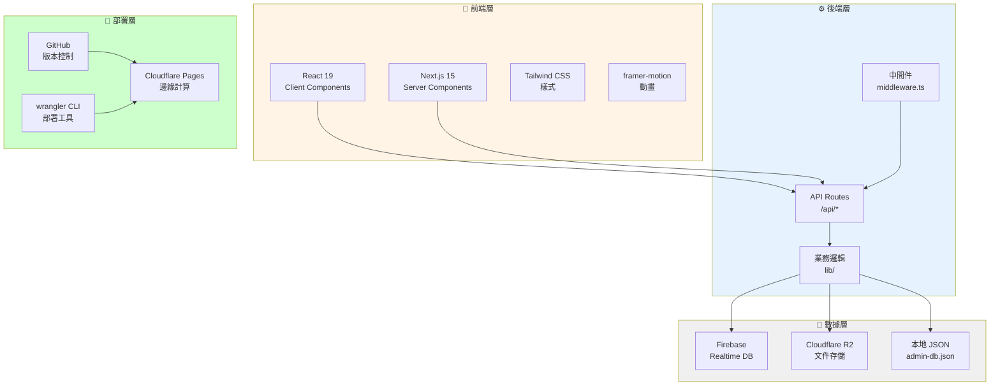

# 🌿 自性光林 (Zixing Guanglin) - 項目結構完整指南

## 📚 目錄結構總覽

```
zixing/
├── app/                          # Next.js 應用核心（App Router）
├── components/                   # React 可複用組件
├── lib/                          # 工具函數和業務邏輯
├── data/                         # 靜態數據和配置
├── public/                       # 靜態資源
├── .env.local                    # 環境變數配置
├── next.config.ts                # Next.js 配置
├── wrangler.toml                 # Cloudflare Pages 配置
├── tsconfig.json                 # TypeScript 配置
├── package.json                  # 依賴管理
└── README.md                     # 項目說明
```

---

## 📂 資料夾詳細介紹

### 🏗️ **`/app` - Next.js 應用主體**

Next.js 15 App Router 根目錄，包含所有頁面、API 路由和中間件。

#### 結構：
```
app/
├── layout.tsx                    # 根布局（全應用共用）
├── page.tsx                      # 首頁 (/)
├── globals.css                   # 全局樣式
│
├── admin/                        # 📊 管理後台模塊
│   ├── layout.tsx               # 後台布局
│   ├── page.tsx                 # 管理主面板
│   ├── login/page.tsx           # 登入頁面
│   ├── courses/page.tsx         # 課程管理
│   ├── members/page.tsx         # 會員管理
│   ├── products/page.tsx        # 產品管理
│   ├── lantern-sea/page.tsx     # 蓮燈管理
│   ├── notifications/page.tsx   # 通知管理
│   ├── practice-logs/page.tsx   # 練習日誌
│   └── settings/page.tsx        # 系統設置
│
├── api/                         # 🔌 API 端點
│   ├── admin/                   # 管理 API
│   │   ├── auth/                # 身份驗證
│   │   │   ├── login/route.ts   # 登入端點
│   │   │   └── logout/route.ts  # 登出端點
│   │   ├── dashboard/route.ts   # 儀表板數據
│   │   ├── accounts/            # 帳戶管理
│   │   ├── upload/              # 文件上傳
│   │   │   ├── file/route.ts    # 本地上傳
│   │   │   ├── local/route.ts   # 本地存儲
│   │   │   ├── presign/route.ts # R2 預簽名
│   │   │   └── status/route.ts  # 上傳狀態
│   │   └── [entity]/            # 通用 CRUD
│   │       ├── route.ts         # 列表/創建
│   │       └── [id]/route.ts    # 詳情/更新/刪除
│   │
│   └── public/                  # 公開 API
│       ├── [entity]/route.ts    # 公開資源
│       └── r2/[...key]/route.ts # R2 圖片代理
│
├── products/                    # 🎁 產品相關頁面
│   ├── page.tsx                 # 產品列表
│   ├── [id]/page.tsx            # 產品詳情（服務器組件）
│   ├── [id]/product-detail-client.tsx  # 產品詳情客戶端
│   └── light-patch/page.tsx     # 光貼特色頁
│
├── deng-deng/page.tsx           # 開開見喜頁面
├── join/page.tsx                # 加入會員頁面
├── practice-notebook/page.tsx   # 練習筆記本頁面
├── qinian-hall/page.tsx         # 齊天大聖廳頁面
│
└── middleware.ts                # 中間件（路由守護）
```

#### 關鍵特性：
- ✅ **服務器組件 + 客戶端組件混合**
- ✅ **動態路由**：`/products/[id]` 使用 `generateStaticParams()`
- ✅ **API Routes**：完整的 REST API
- ✅ **SSR + SSG 混合**：靜態預生成 + 動態伺服器渲染

---

### 🎨 **`/components` - 可複用 React 組件**

存放所有可複用的 UI 組件和功能組件。

#### 結構：
```
components/
├── Navigation.tsx               # 導航欄
├── Footer.tsx                   # 頁腳
├── HeroSection.tsx              # 英雄區
├── DailyPractice.tsx            # 日常實踐
├── DailyWisdom.tsx              # 每日智慧
├── FeaturesSection.tsx          # 功能展示區
├── Products.tsx                 # 產品展示
├── LanternSea.tsx               # 蓮花燈海（互動）
├── MemberTree.tsx               # 會員樹展示
├── Blessings.tsx                # 祝福卡
├── SmoothScrollProvider.tsx      # 平滑滾動提供商
├── Icons.tsx                    # 圖標集合
│
├── admin/                       # 管理後台組件
│   ├── AdminShell.tsx           # 後台布局殼
│   ├── AdminPageHeader.tsx      # 頁面標題
│   ├── AdminUI.tsx              # 管理 UI 組件
│   └── ImageUploadField.tsx     # 圖片上傳字段
│
└── Logo/                        # 📁 Logo 和品牌圖片
    ├── Lantern.png
    ├── Lantern Sea.png
    ├── Lantern Sea2.png
    ├── Hero Background.png
    ├── Chakra.png
    └── lantern2.png
```

#### 主要組件職責：
| 組件 | 用途 |
|------|------|
| **Navigation** | 全站導航欄 |
| **LanternSea** | 互動式蓮燈頁面 |
| **Products** | 產品卡片網格 |
| **AdminShell** | 後台頁面容器 |
| **ImageUploadField** | 管理員圖片上傳 |

---

### 📚 **`/lib` - 業務邏輯和工具函數**

核心功能實現和助手函數。

#### 結構：
```
lib/
├── admin/                       # 管理功能
│   ├── accounts.ts              # 帳戶管理邏輯
│   ├── authz.ts                 # 授權檢查
│   ├── service.ts               # 業務服務層
│   ├── repository.ts            # 數據倉庫層
│   ├── validation.ts            # 數據驗證
│   ├── types.ts                 # TypeScript 類型定義
│   ├── local-db.ts              # 本地 JSON DB 操作
│   ├── mock-data.ts             # 模擬數據
│   │
│   └── auth/                    # 身份驗證
│       └── session.ts           # Session 管理
│
├── firebase/                    # Firebase 配置
│   └── admin.ts                 # Firebase Admin SDK
│
├── products/                    # 產品相關邏輯
│   └── experience.ts            # 產品體驗助手函數
│       ├── getCategoryPill()
│       ├── getEnergy()
│       ├── getMoodTags()
│       ├── getContexts()
│       ├── getReflection()
│       └── getMeritAmount()
│
└── r2/                          # Cloudflare R2 存儲
    ├── client-upload.ts         # 客戶端上傳邏輯
    └── server.ts                # 服務器端上傳邏輯
```

#### 核心函數示例：
```typescript
// 產品體驗助手
getCategoryPill(category: string): string
getEnergy(category: string): EnergyMap
getMoodTags(category: string, name: string, desc: string): string[]

// 管理功能
validateProduct(product: Product): ValidationResult
checkAdminPermission(userId: string): boolean
```

---

### 📊 **`/data` - 靜態數據和配置**

預定義的數據集和配置。

#### 文件說明：
| 文件 | 用途 |
|------|------|
| **admin-db.json** | 產品、課程等主要數據 |
| **admin-accounts.json** | 管理員帳號數據 |

#### 數據結構示例：
```json
{
  "products": [
    {
      "id": "p-1",
      "name": "清淨月光香",
      "category": "香品",
      "moodTags": ["寧靜", "專注"],
      "energyAttributes": {
        "stability": 4,
        "wisdom": 5,
        "focus": 3,
        "healing": 2,
        "balance": 4
      }
    }
  ],
  "accounts": [...]
}
```

---

### 📁 **`/public` - 靜態資源**

不需要處理的靜態文件。

```
public/
├── index.html              # 備用 HTML
└── [其他靜態資源]
```

---

### ⚙️ **配置文件**

| 文件 | 用途 |
|------|------|
| **next.config.ts** | Next.js 構建配置 |
| **wrangler.toml** | Cloudflare Pages 配置 |
| **tsconfig.json** | TypeScript 編譯配置 |
| **postcss.config.mjs** | CSS 後處理配置 |
| **eslint.config.mjs** | 代碼檢查配置 |

#### 關鍵配置：
```toml
# wrangler.toml
name = "linqtw"
compatibility_date = "2026-06-17"
pages_build_output_dir = ".next"
```

```typescript
// next.config.ts
images: {
  unoptimized: true  // Cloudflare 相容性
},
compress: true
```

---

## 🔄 功能流程圖

### 1. 用戶流程 - 瀏覽者

```mermaid
graph TD
    A[訪問 linqtw.pages.dev] --> B[首頁加載]
    B --> C{瀏覽}
    C -->|查看產品| D[/products]
    C -->|點燈許願| E[/lantern-sea]
    C -->|其他| F[其他頁面]
    
    D --> G[產品列表]
    G --> H[點擊產品]
    H --> I[/products/[id]]
    I --> J[查看詳情]
    J --> K{操作}
    K -->|收藏| L[💖 保存到 localStorage]
    K -->|購買| M[立即請回]
    K -->|推薦| N[查看相關產品]
    
    E --> O[蓮燈互動]
    O --> P[選擇燈種]
    P --> Q[輸入願景]
    Q --> R[點燈完成]
    
    style L fill:#ffcccc
    style M fill:#ccffcc
```

### 2. 管理員流程

```mermaid
graph TD
    A[進入 /admin/login] --> B{驗證}
    B -->|成功| C[進入後台]
    B -->|失敗| D[重試登入]
    
    C --> E{管理任務}
    E -->|產品| F[/admin/products]
    E -->|課程| G[/admin/courses]
    E -->|會員| H[/admin/members]
    E -->|上傳| I[文件上傳]
    
    F --> J[CRUD 操作]
    I --> K{上傳類型}
    K -->|本地| L[上傳到服務器]
    K -->|R2| M[獲取預簽名 URL]
    M --> N[前端直傳 R2]
    
    style B fill:#e6f3ff
    style J fill:#f0f0f0
```

### 3. 數據流 - 產品詳情



### 4. API 調用流程



### 5. 構建和部署流程



---

## 🎯 主要業務流程

### 產品展示流程

```
首頁 
  ↓
產品列表 (/products)
  ├─ 分類篩選
  ├─ 搜索功能
  └─ 產品卡片網格
    ↓
點擊產品卡片
  ↓
產品詳情頁 (/products/[id])
  ├─ Server Component (page.tsx)
  │   └─ generateStaticParams() 預生成
  └─ Client Component (product-detail-client.tsx)
    ├─ 收藏功能 (💖)
    ├─ 能量屬性展示
    ├─ 相關產品推薦
    └─ 立即請回按鈕
```

### 管理員操作流程

```
管理後台登入 (/admin/login)
  ↓
驗證帳號密碼 (/api/admin/auth/login)
  ↓
進入管理面板 (/admin)
  ├─ 產品管理
  │   ├─ 查看列表 (GET /api/admin/products)
  │   ├─ 創建產品 (POST /api/admin/products)
  │   ├─ 編輯產品 (PATCH /api/admin/products/[id])
  │   └─ 刪除產品 (DELETE /api/admin/products/[id])
  │
  ├─ 文件上傳
  │   ├─ 本地上傳 (POST /api/admin/upload/local)
  │   └─ R2 雲上傳 (POST /api/admin/upload/presign)
  │
  └─ 其他管理功能
```

---

## 📊 技術架構總覽



---

## 🚀 快速開發指南

### 添加新頁面
1. 在 `/app` 創建新資料夾
2. 創建 `page.tsx`
3. 自動成為路由

### 添加 API 端點
1. 在 `/app/api` 創建路由
2. 導出 `GET`, `POST`, `PATCH`, `DELETE` 函數
3. 返回 `NextResponse`

### 添加可複用組件
1. 在 `/components` 創建 `.tsx` 文件
2. 使用 `export default` 導出
3. 在其他組件導入使用

### 添加業務邏輯
1. 在 `/lib` 創建新目錄
2. 實現助手函數
3. 從組件或 API 導入

---

## 📦 部署檢查清單

- [ ] 代碼提交到 GitHub
- [ ] wrangler.toml 配置正確
- [ ] 環境變數設置 (.env.local)
- [ ] Cloudflare Pages 連接 GitHub
- [ ] Build command: `npm run build`
- [ ] Build output: `.next`
- [ ] 構建日誌無錯誤
- [ ] 訪問 linqtw.pages.dev 驗證

---

## 🐛 常見問題排查

| 問題 | 原因 | 解決方案 |
|------|------|--------|
| 頁面 404 | 路由不存在 | 檢查 `/app` 目錄結構 |
| API 調用失敗 | 環境變數缺失 | 檢查 `.env.local` |
| 圖片無法加載 | R2 配置錯誤 | 驗證 R2 連接和權限 |
| 構建失敗 | TypeScript 錯誤 | 執行 `npm run build` 本地測試 |

---

*最後更新：2026-06-25*
*自性光林 © 禪修法物電商平台*
