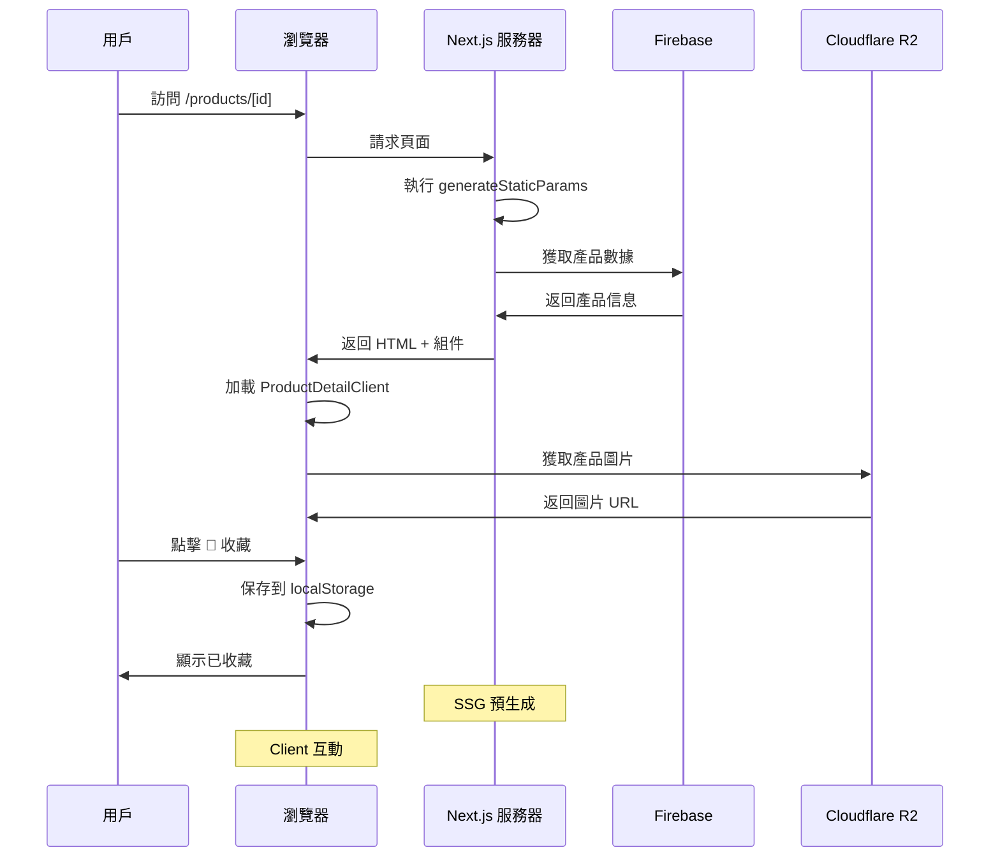
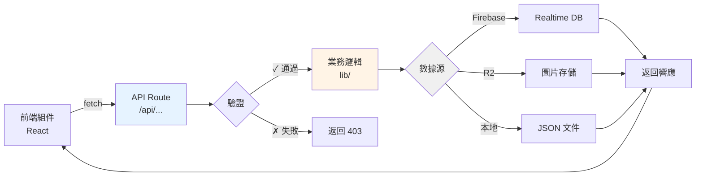
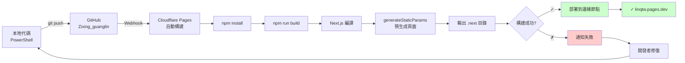
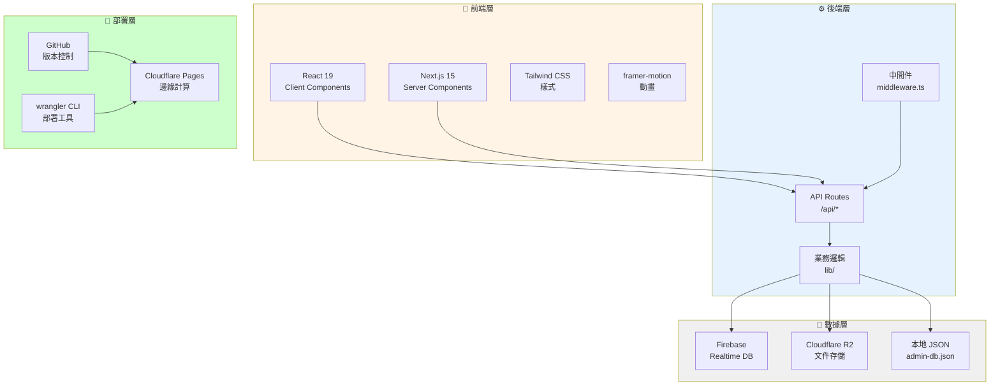

# 🌿 自性光林 (Zixing Guanglin) - 項目結構完整指南

## 📚 根目錄主要文件和資料夾

項目根目錄包含以下主要文件和資料夾：

| 文件/資料夾 | 用途 |
|-----------|------|
| **app/** | Next.js 應用核心，包含所有頁面、API 路由和中間件 |
| **components/** | React 可複用組件庫 |
| **lib/** | 工具函數和業務邏輯 |
| **data/** | 靜態數據和配置文件 |
| **public/** | 靜態資源和資訊 |
| **.env.local** | 環境變數配置（API 密鑰、Firebase 配置等） |
| **next.config.ts** | Next.js 構建和運行配置 |
| **wrangler.toml** | Cloudflare Pages 部署配置 |
| **tsconfig.json** | TypeScript 編譯選項 |
| **package.json** | npm 依賴管理和腳本命令 |
| **postcss.config.mjs** | CSS 後處理配置 |
| **eslint.config.mjs** | 代碼檢查規則 |

---

## 📂 資料夾詳細介紹

### 🏗️ **`/app` - Next.js 應用主體**

這是 Next.js 15 App Router 的根目錄，使用文件系統路由自動生成頁面。

#### 根層級文件
- **layout.tsx** - 全站共用的根布局，定義應用整體結構
- **page.tsx** - 首頁，對應網址 `/`
- **globals.css** - 全局 CSS 樣式

#### 管理後台模塊 - `/admin`
- **layout.tsx** - 後台專用布局
- **page.tsx** - 管理面板首頁
- **login/page.tsx** - 管理員登入頁面
- **products/page.tsx** - 產品管理界面（增刪改查）
- **courses/page.tsx** - 課程管理界面
- **members/page.tsx** - 會員管理界面
- **lantern-sea/page.tsx** - 蓮花燈海數據管理
- **notifications/page.tsx** - 通知系統管理
- **practice-logs/page.tsx** - 練習日誌查看
- **settings/page.tsx** - 系統設置

#### API 路由 - `/api`

**管理 API** (`/api/admin/*`)
- **auth/login/** - 登入驗證端點
- **auth/logout/** - 登出端點
- **accounts/** - 帳戶管理（查看、創建、更新帳號）
- **dashboard/** - 儀表板數據聚合
- **upload/file/** - 本地文件上傳
- **upload/local/** - 本地存儲操作
- **upload/presign/** - Cloudflare R2 預簽名 URL 生成
- **upload/status/** - 上傳進度狀態查詢
- **[entity]/** - 通用 CRUD API（動態實體操作）
  - 支持產品、課程、會員等所有資源類型

**公開 API** (`/api/public/*`)
- **[entity]/** - 公開資源查詢端點（不需身份驗證）
- **r2/[...key]/** - Cloudflare R2 圖片代理服務

#### 產品相關頁面 - `/products`
- **page.tsx** - 產品列表頁面（所有法物展示）
- **[id]/page.tsx** - 產品詳情頁面（服務器組件，支持動態路由）
- **[id]/product-detail-client.tsx** - 產品詳情客戶端交互組件
- **light-patch/page.tsx** - 光貼特色展示頁面

#### 其他公開頁面
- **deng-deng/page.tsx** - 開開見喜頁面（品牌故事）
- **join/page.tsx** - 加入會員頁面
- **practice-notebook/page.tsx** - 練習筆記本工具
- **qinian-hall/page.tsx** - 齊天大聖廳（特色展示）

#### 中間件
- **middleware.ts** - 路由守護和身份驗證邏輯，在每個請求前執行

#### 關鍵特性
- ✅ **混合渲染** - 服務器組件 + 客戶端組件
- ✅ **動態路由** - `/products/[id]` 使用 `generateStaticParams()` 預生成靜態頁面
- ✅ **API Routes** - 完整的 REST API 實現
- ✅ **SSR + SSG** - 靜態預生成和動態伺服器渲染混合

---

### 🎨 **`/components` - React 可複用組件**

存放所有可複用的 UI 組件和功能組件，按功能分類組織。

#### 主要公開組件
- **Navigation.tsx** - 全站導航欄，顯示品牌和菜單
- **Footer.tsx** - 頁腳信息和連結
- **HeroSection.tsx** - 英雄區段（大標題和背景圖）
- **DailyPractice.tsx** - 每日實踐指南展示
- **DailyWisdom.tsx** - 每日智慧語錄組件
- **FeaturesSection.tsx** - 功能特色展示區域
- **Products.tsx** - 產品卡片網格展示
- **LanternSea.tsx** - 蓮花燈海互動頁面（最複雜的組件）
- **MemberTree.tsx** - 會員等級樹形展示
- **Blessings.tsx** - 法物祝福卡組件
- **SmoothScrollProvider.tsx** - 平滑滾動功能提供商
- **Icons.tsx** - 應用內使用的所有圖標集合

#### 管理後台組件 - `/admin`
- **AdminShell.tsx** - 後台頁面外殼和布局容器
- **AdminPageHeader.tsx** - 管理頁面標題欄
- **AdminUI.tsx** - 通用的管理界面組件
- **ImageUploadField.tsx** - 圖片上傳輸入組件

#### 品牌資源 - `/Logo`
- **Lantern.png** - 蓮燈圖片
- **Lantern Sea.png** - 蓮花燈海背景
- **Lantern Sea2.png** - 蓮花燈海模態框背景
- **Hero Background.png** - 首頁英雄區背景
- **Chakra.png** - 脈輪相關圖片
- **lantern2.png** - 額外蓮燈變體

#### 組件職責概覽

| 組件 | 功能 |
|------|------|
| **Navigation** | 跨頁面導航和品牌識別 |
| **LanternSea** | 互動式點燈許願系統 |
| **Products** | 產品卡片列表展示 |
| **AdminShell** | 管理後台頁面容器 |
| **ImageUploadField** | 管理員圖片上傳介面 |

---

### 📚 **`/lib` - 業務邏輯和工具函數**

核心功能實現、數據操作和助手函數集中區域。

#### 管理模塊 - `/admin`
- **accounts.ts** - 帳戶管理邏輯（創建、驗證、查詢用戶）
- **authz.ts** - 授權檢查（判斷用戶是否有操作權限）
- **service.ts** - 業務服務層（高級業務邏輯）
- **repository.ts** - 數據倉庫層（封裝數據訪問）
- **validation.ts** - 數據驗證（確保輸入合法性）
- **types.ts** - TypeScript 類型定義
- **local-db.ts** - 本地 JSON 數據庫操作
- **mock-data.ts** - 模擬測試數據

#### 身份驗證 - `/admin/auth`
- **session.ts** - Session 管理和驗證邏輯

#### Firebase 配置 - `/firebase`
- **admin.ts** - Firebase Admin SDK 初始化和配置

#### 產品功能 - `/products`
- **experience.ts** - 產品體驗相關的助手函數
  - 獲取產品分類標籤
  - 計算產品能量屬性
  - 提取情緒標籤
  - 生成適用情境
  - 反思和冥想文案
  - 功德金計算

#### Cloudflare R2 - `/r2`
- **client-upload.ts** - 客戶端文件上傳邏輯
- **server.ts** - 服務器端上傳處理

---

### 📊 **`/data` - 靜態數據和配置**

預定義的數據集和配置文件，不需要實時更新。

#### 主要文件

| 文件 | 用途 |
|------|------|
| **admin-db.json** | 產品、課程、蓮燈等主要業務數據 |
| **admin-accounts.json** | 管理員帳號和登入信息 |

#### 數據結構說明

**admin-db.json** 包含的數據結構：

產品數據包括產品 ID、名稱、分類、圖片 URL、副標題、詳細描述、情緒標籤、適用情境、修行意義、完整含義、修持步驟、每日觀照語、法物流轉善念文案和能量屬性。

能量屬性包括五個維度：安定、智慧、專注、療癒和平衡，每個維度用 1-5 級評分表示。

相關產品通過產品 ID 連結，支持交叉推薦。

**admin-accounts.json** 包含管理員帳號數據，包括用戶名、密碼哈希和權限級別。

---

### 📁 **`/public` - 靜態資源**

不需要動態處理的靜態文件，由 Web 服務器直接提供。

包含備用 HTML 文件和其他靜態資源，支持直接 URL 訪問。

---

## ⚙️ 配置文件說明

### next.config.ts - Next.js 構建配置
配置 Next.js 構建行為和優化選項。主要設置包括圖片優化禁用（為了 Cloudflare 相容性）、啟用 gzip 壓縮和移除 Powered-By 頭部（安全性）。

### wrangler.toml - Cloudflare Pages 配置
定義項目如何在 Cloudflare Pages 上構建和部署。關鍵設置包括項目名稱 linqtw、兼容性日期 2026-06-17 和構建輸出目錄 .next（告訴 Cloudflare Next.js 構建輸出位置）。

### tsconfig.json - TypeScript 編譯配置
定義 TypeScript 編譯規則，包括模塊解析、類型檢查嚴格度和路徑別名設置。

### postcss.config.mjs - CSS 後處理配置
配置 PostCSS 插件，特別是 Tailwind CSS 集成，處理 CSS 優化和兼容性。

### eslint.config.mjs - 代碼檢查規則
定義代碼風格和品質檢查規則，自動檢測並報告不符合規範的代碼。

---

## 🔄 功能流程圖

### 1. 用戶流程 - 瀏覽者

```mermaid
graph TD
    A[訪問 linqtw.pages.dev] --> B[首頁加載]
    B --> C{瀏覽}
    C -->|查看產品| D[/products]
    C -->|點燈許願| E[/lantern-sea]
    C -->|其他| F[其他頁面]
    
    D --> G[產品列表]
    G --> H[點擊產品]
    H --> I[/products/[id]]
    I --> J[查看詳情]
    J --> K{操作}
    K -->|收藏| L[💖 保存到 localStorage]
    K -->|購買| M[立即請回]
    K -->|推薦| N[查看相關產品]
    
    E --> O[蓮燈互動]
    O --> P[選擇燈種]
    P --> Q[輸入願景]
    Q --> R[點燈完成]
    
    style L fill:#ffcccc
    style M fill:#ccffcc
```

### 2. 管理員流程

```mermaid
graph TD
    A[進入 /admin/login] --> B{驗證}
    B -->|成功| C[進入後台]
    B -->|失敗| D[重試登入]
    
    C --> E{管理任務}
    E -->|產品| F[/admin/products]
    E -->|課程| G[/admin/courses]
    E -->|會員| H[/admin/members]
    E -->|上傳| I[文件上傳]
    
    F --> J[CRUD 操作]
    I --> K{上傳類型}
    K -->|本地| L[上傳到服務器]
    K -->|R2| M[獲取預簽名 URL]
    M --> N[前端直傳 R2]
    
    style B fill:#e6f3ff
    style J fill:#f0f0f0
```

### 3. 數據流 - 產品詳情



### 4. API 調用流程



### 5. 構建和部署流程



---

## 🎯 主要業務流程

### 產品展示流程

首頁 → 產品列表（支持分類篩選和搜索）→ 點擊產品卡片 → 產品詳情頁面

詳情頁面由服務器組件（生成靜態頁面）和客戶端組件（提供互動功能）組成。

客戶端功能包括收藏（通過 localStorage）、能量屬性展示、相關產品推薦和立即請回按鈕。

### 管理員操作流程

進入管理後台登入頁 → 輸入帳號密碼驗證 → 進入管理面板

管理功能包括產品管理（查看、創建、編輯、刪除）、文件上傳（本地或 R2 雲存儲）、課程和會員管理、系統設置等。

### 蓮花燈海互動流程

訪問蓮燈頁面 → 選擇燈種類（平安守護、智慧學業等）→ 輸入個人願景 → 點燈完成 → 動畫效果展示 → 數據保存到 Firebase

---

## 📊 技術架構總覽



---

## 🚀 快速開發指南

### 添加新頁面
在 `/app` 創建新資料夾並添加 page.tsx 文件，Next.js 會自動將其轉換為路由。例如創建 `/app/new-page/page.tsx` 會自動成為 `/new-page` 路由。

### 添加 API 端點
在 `/app/api` 創建路由文件夾，導出 HTTP 方法（GET、POST、PATCH、DELETE），返回 NextResponse 對象。系統會自動將其視為 API 端點。

### 添加可複用組件
在 `/components` 創建 TypeScript React 文件，使用 `export default` 導出組件。在其他組件中導入即可複用。

### 添加業務邏輯
在 `/lib` 創建新目錄分組相關功能，實現助手函數和業務服務。從 API 路由或組件導入使用。

---

## 📦 部署檢查清單

- [ ] 代碼提交到 GitHub
- [ ] wrangler.toml 配置正確
- [ ] 環境變數設置 (.env.local)
- [ ] Cloudflare Pages 連接 GitHub
- [ ] Build command: `npm run build`
- [ ] Build output: `.next`
- [ ] 構建日誌無錯誤
- [ ] 訪問 linqtw.pages.dev 驗證

---

## 🐛 常見問題排查

| 問題 | 原因 | 解決方案 |
|------|------|--------|
| 頁面 404 | 路由不存在 | 檢查 `/app` 目錄結構和文件名 |
| API 調用失敗 | 環境變數缺失 | 檢查 `.env.local` 配置 |
| 圖片無法加載 | R2 配置錯誤 | 驗證 Cloudflare R2 連接和權限 |
| 構建失敗 | TypeScript 類型錯誤 | 執行 `npm run build` 本地測試 |
| 部署不更新 | GitHub 連接問題 | 檢查 Cloudflare Pages 設置和 Webhook |

---

## 📖 主要技術棧

**前端框架**
- Next.js 15.3.2 - React 應用框架，支持 SSR、SSG、API Routes
- React 19 - 用戶界面庫
- TypeScript - 類型安全的 JavaScript
- Tailwind CSS - 實用優先的 CSS 框架
- framer-motion - 動畫和交互庫

**後端/數據**
- Firebase Admin SDK - 後端數據庫和認證管理
- Firebase Realtime DB - 實時數據同步
- Cloudflare R2 - 對象存儲服務
- AWS SDK - 備用文件操作

**部署與開發工具**
- Cloudflare Pages - 邊緣計算平台
- GitHub - 版本控制
- wrangler - Cloudflare 命令行工具
- npm - 包管理器

---

*最後更新：2026-06-25*
*自性光林 © 禪修法物電商平台*
